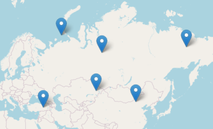

# Temperature Anywhere
A web app to get temperature on the map 

  
This app uses [this weather API](https://www.weatherapi.com/) to fetch weather conditions and temperatures. Here are some screenshots 

  
# Contributor note
This project is a bit messy. The development environment is basically nonexistent, since I haven't found a way to get a vercel app working locally. It is not recommended to contribute to this repo, but you can still use the code for other purposes as long as you follow the license.