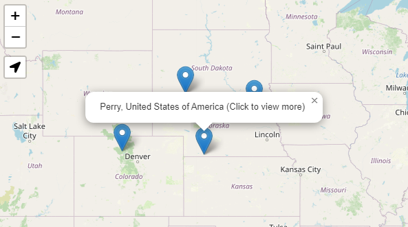
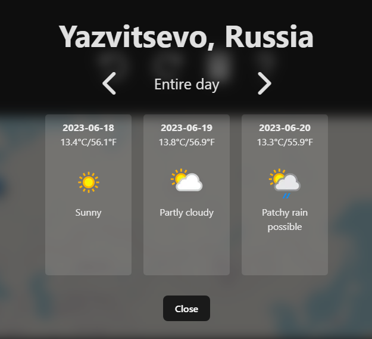

# Temperature Anywhere

A web app to obtain weather forecast data anywhere on the map

## Functionality:
- Add markers on a map 

- Reveal weather data on click 

## Acknowledgements
 - [WeatherAPI](https://awesomeopensource.com/project/elangosundar/awesome-README-templates), the API used for getting geolocation and weather data 
 - Libraries used: React, Leaflet, Express
 - Tools used: Vite, Vercel

## Contributions
This project is a bit messy. The development environment is basically nonexistent, since I haven't found a way to get a vercel app working locally. It is not recommended to contribute to this repo, but you can still use the code for other purposes as long as you follow the license.

## Authors
- [me](https://www.github.com/megarion) (what did you expect)
